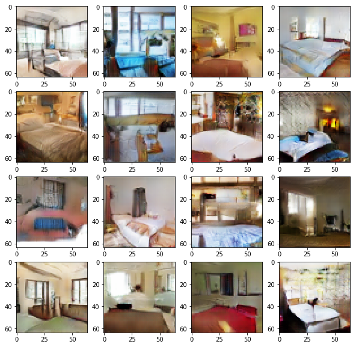

# Wasserstein-Gan
This is an implimentation of Wasserstein Gan (https://arxiv.org/pdf/1701.07875.pdf).

# Code usage
Usage instructions found here: [user manual page](USAGE.md).

## Example Output
### LSUN Bedroom Dataset

