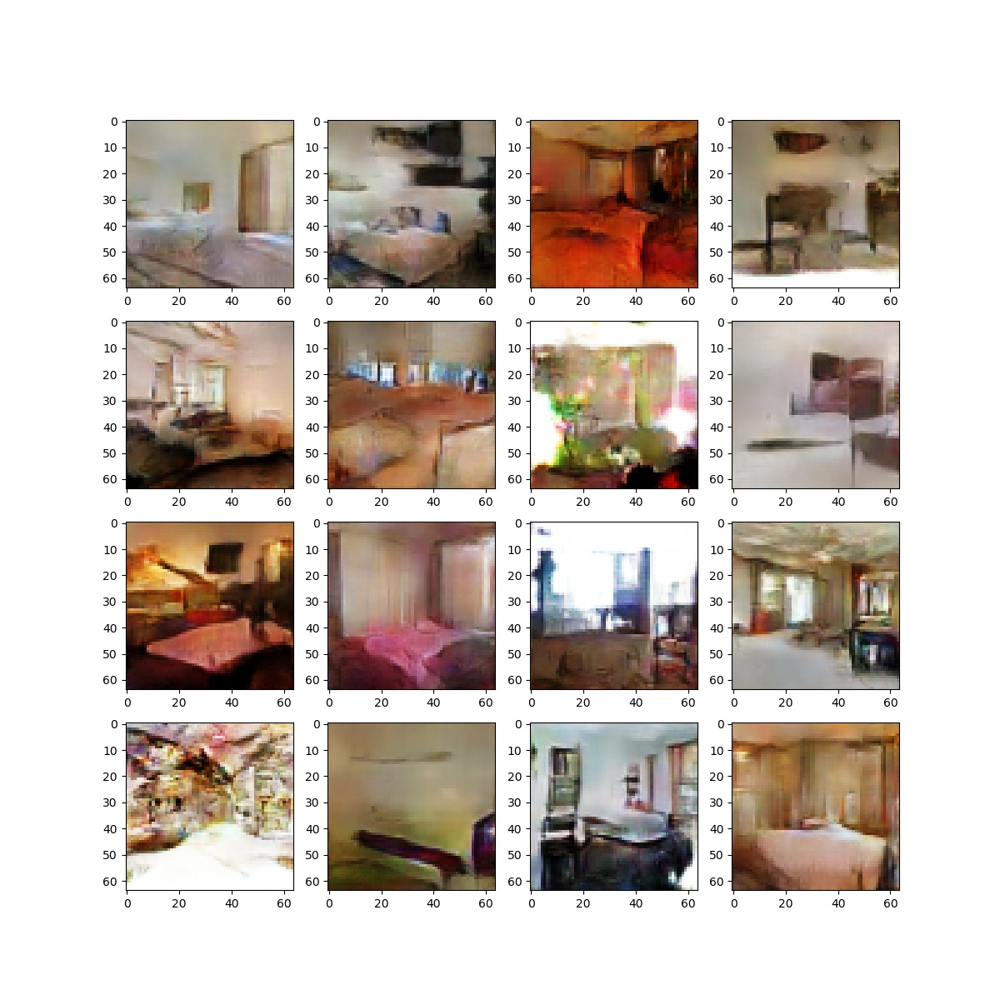

## Getting Started
- Install torch and dependencies from https://github.com/torch/distro
- Install packages 'tqdm', 'matplotlib', 'unrar', 'cv2'

- Clone this repo:
```bash
git clone https://github.com/NeuralVFX/wasserstein-gan.git
cd wasserstein-gan
```
- Download the dataset (e.g. [lsun_bedroom (20%)](https://www.kaggle.com/jhoward/lsun_bedroom/downloads/lsun_bedroom.zip/1)):

- Or try any dataset with at least a coupple thousand images of similar domain

## Train The Model
```bash
python train.py --dataset bedroom --train_folder train --data_perc .006 --save_root bedroom


```

## Continue Training Existing Saved State
```bash
python train.py --load_state output/lsun_006_perc_24.json --dataset bedroom --train_folder train --data_perc .006 --save_root bedroom
```

## Command Line Arguments

```
--dataset', default='bedroom', type=str                    # Dataset folder name
--train_folder', default='train', type=str                 # Train folder name
--in_channels', default=3, type=int                        # Channels in image
--batch_size', default=128, type=int                       # Training batch size
--gen_filters', default=512, type=int                      # Filter count for generator
--disc_filters', default=512, type=int                     # Filter count for discrimintors
--z_size', default=100, type=int                           # Size of latent vector Z
--output_size', default=64, type=int                       # Image Training Size (Image is resized to this value in dataloader)
--data_perc', default=.003, type=float                     # Percentage of dataset to use, selected with fixed random seed
--lr_disc', default=1e-4, type=float                       # Learning rate for discriminator
--lr_gen', default=1e-4, type=float                        # Learning rate for generator
--train_epoch', default=300, type=int                      # Number lookps trough training set
--gen_layers', default=3, type=int                         # Count of transpose layers in generator
--disc_layers', default=3, type=int                        # Count of conv layers in discriminator
--save_every', default=3, type=int                         # How many epochs to train between every save
--save_root', default='lsun_test', type=str                # Prefix for files created by the model under the /output directory
--load_state', type=str                                    # Optional: filename of state to load and resume training from
```

## Data Folder Structure

- This is the folder layout that the data is expected to be in:

`data/<data set>/<train folder>/

- If you have unzipped the bedroom dataset into a train directory it would look like this:

Train Dir:

`data/bedroom/train/`

## Output Folder Structure

- `weights`, `test images`, `loss graph` and `learning rate graph`, are all output to this directory: `output/<save_root>_*.*`

- Learning Rate Graph Example: `output/bedropom_train_learning_rate_schedule.jpg`


- Loss Graph Example: `output/bedroom_train_loss.jpg`


- Test Image Example (output every loop through dataset): `output/bedroom_126.jpg`


## Other Notes

- The random seed used to generate Z is set to the same value every time a preview iamge is generated


